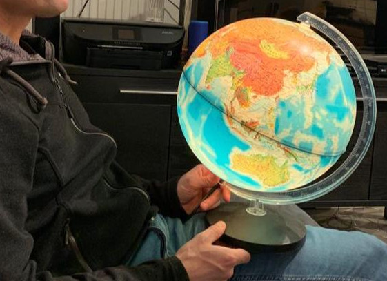

GIS and cartography at [Eurostat](https://ec.europa.eu/eurostat/). Previously at [IGN France](https://www.ign.fr/) and [JRC](https://joint-research-centre.ec.europa.eu/). Geographical information, maps, orienteering, trail running, biking, nature, Europe, Luxembourg, Marseille, Haut-Doubs.

