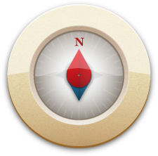

## Page under construction

I should first see how to properly make this page with:

- [https://guides.github.com/features/pages/](https://guides.github.com/features/pages/)
- [https://jekyllrb.com/](https://jekyllrb.com/)

## So, what to say here?

This is supposed to be a page about myself apparently. I may include some of these links:

With a list of some stuff I wrote:

- [2004_ws](doc/pub/2004_ws.pdf)
- [2005_ws](doc/pub/2005_WS_julien_gaffuri.pdf)
- [2006_JFSMA_paper6_gaffuri](doc/pub/2006_JFSMA_paper6_gaffuri.pdf)
- [2006_WS_ICA6Gaffuri](doc/pub/2006_WS_ICA6Gaffuri.pdf)
- [2006_autocarto](doc/pub/2006_autocarto.pdf)
- [2007_GI_days_gaffuri](doc/pub/2007_GI_days_gaffuri.pdf)
- [2007_icc_gaffuri](doc/pub/2007_icc_gaffuri.pdf)
- [2007_icc_gaffuri_fr](doc/pub/2007_icc_gaffuri_fr.pdf)
- [2008_SDH](doc/pub/2008_SDH.pdf)
- [2008_WS_gaffuri](doc/pub/2008_WS_gaffuri.pdf)
- [2009_ICITA](doc/pub/2009_ICITA.pdf)
- [2009_icc_gaffuri](doc/pub/2009_icc_gaffuri.pdf)
- [2009_icc_gaffuri_fr](doc/pub/2009_icc_gaffuri_fr.pdf)
- [2010_ECCS](doc/pub/2010_ECCS.pdf)
- [2010_GIScience_paper_116](doc/pub/2010_GIScience_paper_116.pdf)
- [2010_GIScience_paper_144](doc/pub/2010_GIScience_paper_144.pdf)
- [2010_Mound](doc/pub/2010_Mound-ecai.pdf)
- [2010_WS_renard](doc/pub/2010_WS_renard.pdf)
- [2010_jfsma](doc/pub/2010_jfsma.pdf)
- [2011_ICC_Taillandier_Gaffuri](doc/pub/2011_ICC_Taillandier_Gaffuri.pdf)
- [2012_IJGIS](doc/pub/2012_IJGIS.pdf)
- [2012_java4inspire](doc/pub/2012_java4inspire.pdf)
- [2012_java4inspire_poster_gaffuri_inspire_conf](doc/pub/2012_java4inspire_poster_gaffuri_inspire_conf.pdf)
- [2013_webcartoWS_INSPIRE_Portrayal](doc/pub/2013_webcartoWS_INSPIRE_Portrayal.pdf)
- [article_cartographica_draft](doc/pub/article_cartographica_draft.pdf)
- [cours_generalisation_automatique](doc/pub/cours_generalisation_automatique.pdf)
- [gisscience2012_gaffuri_draft](doc/pub/gisscience2012_gaffuri_draft.pdf)
- [paper_gaffuri_lund_2011](doc/pub/paper_gaffuri_lund_2011.pdf)

